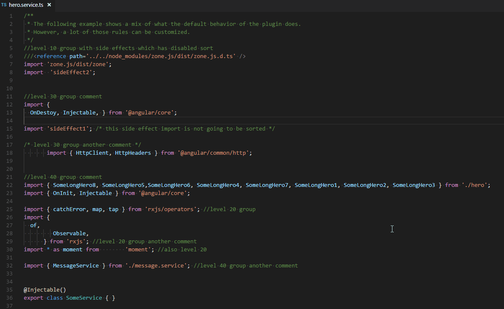
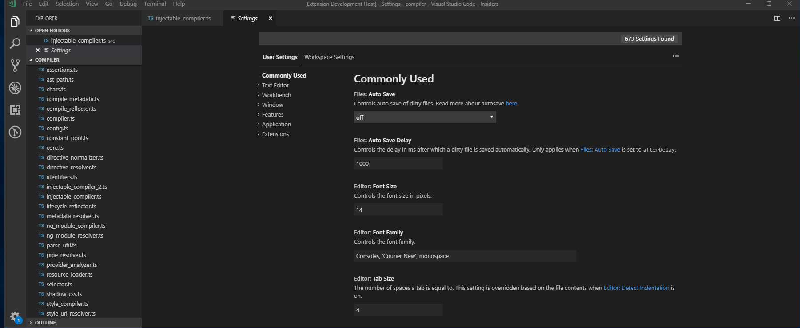

# import-sorter-redux

The `import-sorter-redux` extension is a powerful Visual Studio Code tool that brings back and enhances the functionality of the original [`import-sorter`](https://github.com/SoominHan/import-sorter) library. It provides seamless sorting of TypeScript imports based on a customizable configuration, allowing you to effortlessly maintain code organization.

## Examples

Different types of sorting in a file:


Deep directory sorting:


Sorting before save (disabled by default):


Prettier integration:


## Features

Currently, the sorting functionality only supports the TypeScript language.

## Usage

To run the sorter, use the `Sort Imports` command from the `Command Palette` (Ctrl+Shift+P).

Alternatively, you can enable the option `importSorter.generalConfiguration.sortOnBeforeSave` to automatically trigger sorting before each save operation.

You can also customize keybindings. The default keybinding is `ctrl + alt + o`.

For deep directory sorting, you can use the feature accessible from the `resource explorer`. Right-click and select `Sort imports (Directory deep)`.

**Note:** Before performing global source code sorting, ensure that the project is managed by a version control system. The sorter will sort and rewrite the source code without prompting for confirmation.

## Running Tests

### Test Explorer

To facilitate running tests in VS Code, follow these steps:

1. Install the [Test Explorer UI](https://marketplace.visualstudio.com/items?itemName=hbenl.vscode-test-explorer) extension from the Visual Studio Code Marketplace.
2. Install the [Mocha Test Explorer](https://marketplace.visualstudio.com/items?itemName=hbenl.vscode-mocha-test-adapter) extension from the Visual Studio Code Marketplace.
3. Once both extensions are installed, you can conveniently execute your tests using the [Testing](https://marketplace.visualstudio.com/items?itemName=hbenl.vscode-test-explorer) view in VS Code.

By following these steps, you can utilize the Test Explorer UI and Mocha Test Explorer extensions to streamline the process of running tests directly within the Testing view in VS Code, simplifying test execution and enhancing your testing workflow.

### `vscode-test` Framework

To run tests for your VS Code extension using the `vscode-test` framework, follow these steps:

1. Open the debug view by pressing `Ctrl+Shift+D` (`Cmd+Shift+D` on Mac).
2. From the launch configuration dropdown, select `Launch Tests`.
3. Press `F5` to execute the tests in a new window with your extension loaded.
4. The test results will be displayed in the debug console.
5. To modify existing tests or add new ones, navigate to the `test/extension.test.ts` file or create new test files within the `test` folder.
   * Test files should follow the naming pattern `**.test.ts` to be recognized by the test runner.
   * You can organize your tests into subfolders within the `test` folder according to your preferred structure.

By following these steps, you can leverage the `vscode-test` framework to execute and monitor tests for your VS Code extension, making it easier to develop and maintain a robust extension with reliable test coverage.

Here are some additional tips for running tests:

* You can run a single test by clicking the green play button next to the test in the Test Explorer.
* You can run a group of tests by selecting the tests in the Test Explorer and clicking the green play button.
* You can run all tests by clicking the green play button at the top of the Test Explorer.
* You can debug tests by setting breakpoints in your test code and then clicking the green play button in the Test Explorer.

## Extension Settings

An example of the default configuration is provided below. For available options, refer to VS Code settings (you can search for `importSorter` to find the available settings).

```json
  // Default file configuration name
  "importSorter.generalConfiguration.configurationFilePath": "./import-sorter.json",

  // Excludes sorting for files which match given regex expression. Regex considers the whole file path. The file path separator is normalized to /
  "importSorter.generalConfiguration.exclude": [],

  // Enables sort before each save of the document
  "importSorter.generalConfiguration.sortOnBeforeSave": false,

  // If true then the import string has a semicolon at the end, otherwise it will not be appended. Default is true
  "importSorter.importStringConfiguration.hasSemicolon": true,

  // The count of units before import is new-lined
  "importSorter.importStringConfiguration.maximumNumberOfImportExpressionsPerLine.count": 100,

  // The type of length restriction, before import is moved to a new line
  "importSorter.importStringConfiguration.maximumNumberOfImportExpressionsPerLine.type": "maxLineLength",

  // The number of new lines after the last sorted import
  "importSorter.importStringConfiguration.numberOfEmptyLinesAfterAllImports": 1,

  // The path quotes
  "importSorter.importStringConfiguration.quoteMark": "single",

  // Number of spaces after comma
  "importSorter.importStringConfiguration.spacingPerImportExpression.afterComma": 1,

  // Number of spaces after {
  "importSorter.importStringConfiguration.spacingPerImportExpression.afterStartingBracket": 1,

  // Number of spaces before comma
  "importSorter.importStringConfiguration.spacingPerImportExpression.beforeComma": 0,

  // Number of spaces before }
  "importSorter.importStringConfiguration.spacingPerImportExpression.beforeEndingBracket": 1,

  // Left number of spaces for the new lined imports. If tabType is set to 'tab', then the configuration defines the size of the tab in number of spaces
  "importSorter.importStringConfiguration.tabSize": 4,

  // Defines the character which will be printed on each new lined import expression
  "importSorter.importStringConfiguration.tabType": "space",

  // If always/multiLine then adds a trailing comma at the end of the imports for 'single and multi' and 'multi-line' imports respectively. Default is none therefore no trailing comma
  "importSorter.importStringConfiguration.trailingComma": "none",

  // The default number of empty lines after any group. This has lesser priority than empty lines in rules
  "importSorter.sortConfiguration.customOrderingRules.defaultNumberOfEmptyLinesAfterGroup": 1,

  // The default order level of everything that is not included in rules
  "importSorter.sortConfiguration.customOrderingRules.defaultOrderLevel": 20,

  // Disable sorting of path on the default group
  "importSorter.sortConfiguration.customOrderingRules.disableDefaultOrderSort": false,

  // The default order level of everything that is not included in rules
  "importSorter.sortConfiguration.customOrderingRules.rules": [
        {
            "type": "importMember",
            "regex": "^$",
            "orderLevel": 10,
            "disableSort": true
        },
        {
            "regex": "^[@]",
            "orderLevel": 30
        },
        {
            "regex": "^[.]",
            "orderLevel": 40
        }
  ],

  // Sort Direction of names in curly brackets
  "importSorter.sortConfiguration.importMembers.direction": "asc",

  // Sort Order of names in curly brackets
  "importSorter.sortConfiguration.importMembers.order": "caseInsensitive",

  // Sort Direction of paths
  "importSorter.sortConfiguration.importPaths.direction": "asc",

  // Sort Order of paths
  "importSorter.sortConfiguration.importPaths.order": "caseInsensitive",

  // Combine imports with the same path
  "importSorter.sortConfiguration.joinImportPaths": true,

  // Removes unused imports where we do not have explicit side effects
  "importSorter.sortConfiguration.removeUnusedImports": false,

  // Works only if removeUnusedImports enabled. This option will remove default imports if they are not explicitly used in the source code.
  "importSorter.sortConfiguration.removeUnusedDefaultImports": false
```

## Configuration Details

The Import Sorter extension provides several configuration options to customize its behavior. These settings allow you to control the import sorting process according to your preferences. Below, we describe the available settings in detail:

### Configuration File Path

The `importSorter.generalConfiguration.configurationFilePath` setting enables reading the configuration from a file. This setting represents a relative path to the root of the open Visual Studio Code workspace. By default, the configuration file path is set to `./import-sorter.json`, which is relative to the workspace (usually where `package.json` is located). Here's an example of the configuration:

```json
  {
    "importStringConfiguration": {
      "trailingComma": "multiLine",
      "tabSize": 4,
      "maximumNumberOfImportExpressionsPerLine": {
        "count": 50
      }
    },
    "sortConfiguration": {
      "customOrderingRules": {
        "defaultNumberOfEmptyLinesAfterGroup": 2
      }
    }
  }
```

Alternatively, you can set the configuration inline in Visual Studio Code's `settings.json` file using the following format:

```json
{
  "importStringConfiguration.trailingComma": "multiLine",
  "importStringConfiguration.tabSize": 4,
  "importStringConfiguration.maximumNumberOfImportExpressionsPerLine.count": 50,
  "sortConfiguration.customOrderingRules.defaultNumberOfEmptyLinesAfterGroup": 2
}
```

Or, you can use the fully qualified setting paths:

```json
{
  "importSorter.importStringConfiguration.trailingComma": "multiLine",
  "importSorter.importStringConfiguration.tabSize": 4,
  "importSorter.importStringConfiguration.maximumNumberOfImportExpressionsPerLine.count": 50,
  "importSorter.sortConfiguration.customOrderingRules.defaultNumberOfEmptyLinesAfterGroup": 2
}
```

### Exclusion Patterns

The `importSorter.generalConfiguration.exclude` setting represents an array of regex expressions to match against full file paths. If a file path matches any of the provided patterns, it will be excluded from the import sorting process. The default value is `[]`. Here's an example of the configuration:

```json
{
  "generalConfiguration": {
    "exclude": [".*polyfill\\.ts"]
  }
}
```

In the example, any path that ends with `polyfill.ts` will be excluded from sorting.

### Custom Ordering Rules

The `importSorter.sortConfiguration.customOrderingRules.rules` setting is a JSON array of regex expressions that define the order of import groups. The default setting is as follows:

```json
[
  {
    "type": "importMember",
    "regex": "^$",
    "orderLevel": 10,
    "disableSort": true
  },
  {
    "regex": "^[@]",
    "orderLevel": 30
  },
  {
    "regex": "^[.]",
    "orderLevel": 40
  }
]
```

The `type` field is optional and defaults to `path` (another valid value is `importMember`). This setting ensures that imports without the `from` keyword (possibly imports with side effects) have the highest order priority of 10. The priority is determined by the `orderLevel` property, with lower values indicating higher priority. The `disableSort` property allows preserving the order of imports within the group when set to true. Imports that match the provided regex patterns are sorted into separate groups based on their order level.

### Import String Configuration

The `importSorter.importStringConfiguration.trailingComma` setting is an enum that can be set to `always`, `multiLine`, or `none`. These options control whether a trailing comma is appended to import declarations. The default value is `none`.

The `importSorter.importStringConfiguration.maximumNumberOfImportExpressionsPerLine.type` setting is an enum that can be set to `words`, `maxLineLength`, or `newLineEachExpressionAfterCountLimit`. It works in conjunction with the `importSorter.importStringConfiguration.maximumNumberOfImportExpressionsPerLine.count` setting, which determines the threshold for moving imports to the next line. The available options are:

* `words`: `count` denotes the maximum number of import expressions per line.
* `maxLineLength`: `count` denotes the maximum number of characters per line.
* `newLineEachExpressionAfterCountLimit`: `count` denotes the maximum number of characters allowed on the first line. If all imports exceed this limit, each import will be placed on a new line.
* `newLineEachExpressionAfterCountLimitExceptIfOnlyOne`: `count` behaves the same as the previous option, except when there is only one import expression. In that case, it will remain on the same line even if the length exceeds the `count` value. This option aligns with the behavior of Prettier and addresses [GitHub Prettier Issue #1954](https://github.com/prettier/prettier/issues/1954).

The `importSorter.importStringConfiguration.tabType` setting is an enum that can be set to `tab` or `space`. These options determine the character used for indentation when imports are placed on a new line. The number of spaces or tabs is determined by the `importSorter.importStringConfiguration.tabSize` setting.

### Example: Default Setup for Prettier Integration

To align the Import Sorter behavior with the defaults of Prettier, you can configure the following settings:

```json
{
  "editor.formatOnSave": true,
  "importSorter.generalConfiguration.sortOnBeforeSave": true,
  "importSorter.importStringConfiguration.maximumNumberOfImportExpressionsPerLine.type": "newLineEachExpressionAfterCountLimitExceptIfOnlyOne",
  "importSorter.importStringConfiguration.maximumNumberOfImportExpressionsPerLine.count": 80,
  "importSorter.importStringConfiguration.tabSize": 2,
  "importSorter.importStringConfiguration.quoteMark": "double"
}
```

Alternatively, you can set up a `import-sorter.json` configuration file with the following content:

```json
{
    "generalConfiguration.sortOnBeforeSave": true,
    "importStringConfiguration.maximumNumberOfImportExpressionsPerLine.type": "newLineEachExpressionAfterCountLimitExceptIfOnlyOne",
    "importStringConfiguration.maximumNumberOfImportExpressionsPerLine.count": 80,
    "importStringConfiguration.tabSize": 2,
    "importStringConfiguration.quoteMark": "double"
}
```
